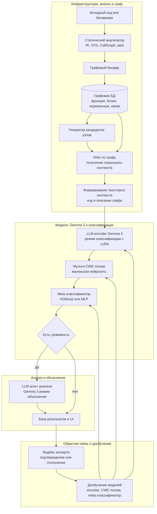

```mermaid
flowchart TB

    %% --- Инфраструктурный слой ---
    subgraph INFRA[Инфраструктура: анализ и граф]
        A[Исходный код или бинарники]
        B[Статический анализатор\nIR, CFG, CallGraph, taint]
        C[Графовый билдер]
        D[(Графовая БД\nфункции, блоки, переменные, связи)]
        E[Генератор кандидатов узлов]
        F[RAG по графу\nполучение локального контекста]
        G[Формирование текстового контекста\nкод и описание графа]

        A --> B --> C --> D
        D --> E --> F
        D --> F
        F --> G
    end

    %% --- Модельный слой: Gemma 3 и головы ---
    subgraph MODELS[Модели: Gemma 3 и классификация]
        H[LLM encoder Gemma 3\nрежим классификации с LoRA]
        I[Мульти CWE голова\nмаленькая нейросеть]
        J[Meta классификатор\nXGBoost или MLP]
        K{Есть уязвимость}
    end

    G --> H --> I --> J --> K

    %% --- Агент анализа и результаты ---
    subgraph ANALYSIS[Анализ и объяснение]
        L[LLM агент анализа\nGemma 3 режим объяснения]
        M[База результатов и UI]
    end

    K -- Да --> L --> M
    K -- Нет --> M

    %% --- Обратная связь и дообучение ---
    subgraph FEEDBACK[Обратная связь и дообучение]
        N[Фидбек эксперта\nподтверждение или отклонение]
        O[Дообучение моделей\nencoder, CWE голова, meta классификатор]
    end

    M --> N --> O
    O --> H
    O --> I
    O --> J
```
