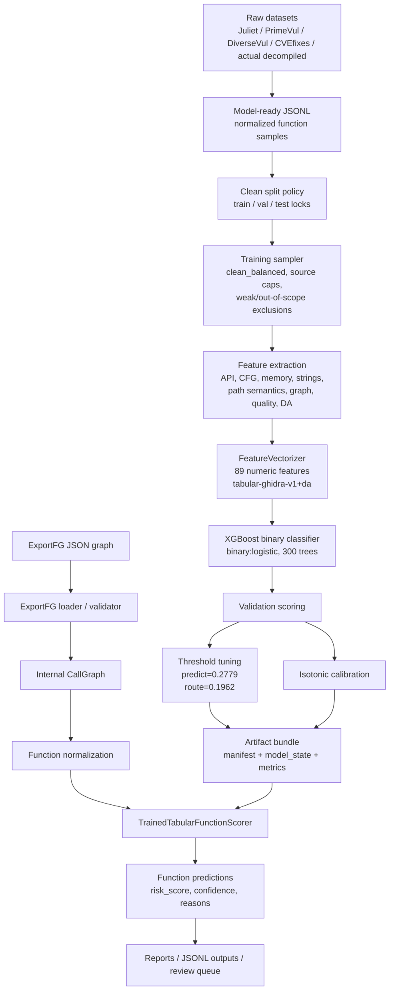

```mermaid
flowchart TD
    A[Raw datasets<br/>Juliet / PrimeVul / DiverseVul / CVEfixes / actual decompiled] --> B[Model-ready JSONL<br/>normalized function samples]
    B --> C[Clean split policy<br/>train / val / test locks]
    C --> D[Training sampler<br/>clean_balanced, source caps,<br/>weak/out-of-scope exclusions]
    D --> E[Feature extraction<br/>API, CFG, memory, strings,<br/>path semantics, graph, quality, DA]
    E --> F[FeatureVectorizer<br/>89 numeric features<br/>tabular-ghidra-v1+da]
    F --> G[XGBoost binary classifier<br/>binary:logistic, 300 trees]
    G --> H[Validation scoring]
    H --> I[Threshold tuning<br/>predict=0.2779<br/>route=0.1962]
    H --> J[Isotonic calibration]
    I --> K[Artifact bundle<br/>manifest + model_state + metrics]
    J --> K

    L[ExportFG JSON graph] --> M[ExportFG loader / validator]
    M --> N[Internal CallGraph]
    N --> O[Function normalization]
    O --> P[TrainedTabularFunctionScorer]
    K --> P
    P --> Q[Function predictions<br/>risk_score, confidence, reasons]
    Q --> R[Reports / JSONL outputs / review queue]
```
![[Pasted image 20260706141447.png]]
